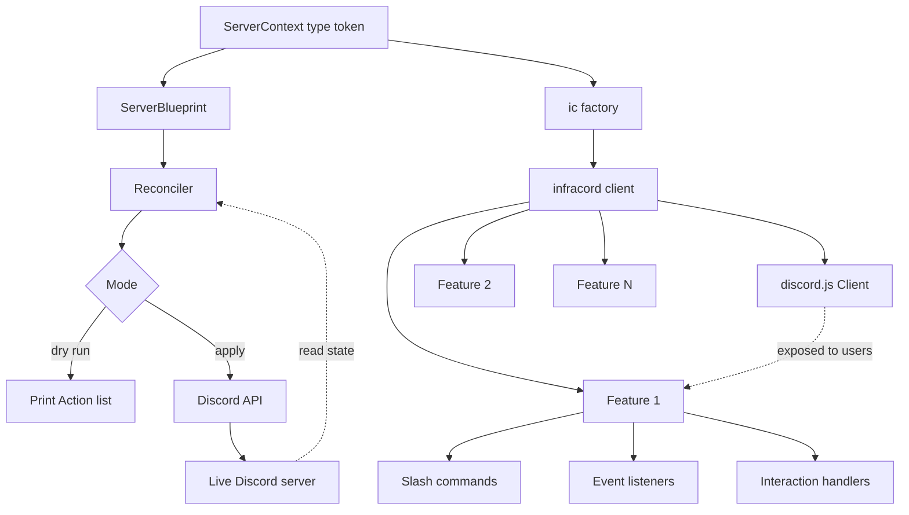

# Architecture Overview

infracord is a framework that wraps the discord.js `Client` and adds two core layers on top: a server blueprint and a feature system. Both layers are connected through a shared type token that carries your server's role, channel, and category names through the entire codebase.

---

## The infracord client

At the centre of the framework is the infracord client. It wraps discord.js, manages the bot lifecycle, and is responsible for:

- Registering features and wiring up their slash commands, event listeners, and interaction handlers
- Running `onStartup` hooks defined by features
- Deploying slash commands to Discord
- Running the reconciler against the blueprint on startup or deploy

The underlying discord.js `Client` is always accessible. You are never locked out of the primitives — infracord adds structure on top of discord.js, it does not replace it.

---

## The two core layers

### Layer 1 — Server blueprint

The blueprint is a TypeScript declaration of your Discord server's desired structure: its roles, categories, channels, and permission overwrites. When you run the reconciler, infracord reads the live server state, computes the difference, and applies only the changes needed to bring the server into sync.

This is the infrastructure layer. It runs at deploy time, not at request time.

### Layer 2 — Feature system

Features are the units of bot logic. Each feature co-locates its slash commands, event listeners, and interaction handlers — buttons, select menus, modals — in one place. Features are registered explicitly at startup through the `ic` factory.

This is the application layer. It runs continuously as the bot handles user activity.

---

## How the layers connect

The connection point is `ServerContext` — a phantom TypeScript type that carries your declared role, channel, and category names through both layers.

```
type MyServer = ServerContext<MyRoles, MyChannels, MyCategories>
                       │
          ┌────────────┴────────────┐
          ▼                         ▼
ServerBlueprint<MyServer>      createIc<MyServer>(blueprint)
  (infrastructure layer)         (application layer)
```

Because both layers share the same `ServerContext`, a feature can reference a channel by its declared name and get a fully typed, live discord.js channel object back — the same channel the blueprint created and manages. There are no string IDs scattered through the codebase. If the channel name does not exist in the blueprint, it is a compile error.

---

## System diagram



---

## Startup sequence

```
1. Define ServerContext type
2. Construct ServerBlueprint
3. Create infracord client
4. Register features via ic factory
5. Start client — reconciler runs, commands deploy, handlers wire up
```

The reconciler can also be run independently at deploy time without starting the bot (for CI/CD pipelines or server management scripts).

Because the blueprint is code, you can point the reconciler at any guild — including a blank development or staging guild — and get an exact replica of your production server structure in seconds. Environment parity is a natural consequence of keeping infrastructure as code.

---

## Key design decisions

**`ServerContext` is a phantom type.** It holds no runtime value. Its only purpose is to carry the string literal unions through the TypeScript type system so that every API surface that needs them can extract them without re-threading three separate generics.

**The discord.js client is exposed.** Users can access it directly at any point inside a feature. The framework provides structure and type safety — it does not restrict what you can do with the underlying client.

**Features are registered explicitly.** There is no file-system scanning, no decorator-based discovery. Every feature is passed to the `ic` factory directly. This makes the full set of registered features visible by reading one place in the codebase.

**The reconciler operates on a single guild.** Running the reconciler across multiple guilds is the caller's responsibility. infracord provides the primitive, the caller decides how to use it.

**Interaction routing is map-based.** Custom IDs for buttons, modals, and select menus are keys in a typed map registered with the feature. There is no string pattern matching.

---

## What infracord does not own

- **The full discord.js Client API** — it is exposed, not hidden. Users can use it directly.
- **Database access** — infracord has no opinion on how you store data.
- **Multi-guild state management** — which blueprint applies to which guild is outside infracord's scope.
- **Application logic structure** — how you organise services, repositories, or business logic is your decision. infracord only prescribes how commands, events, and interactions are wired up.
