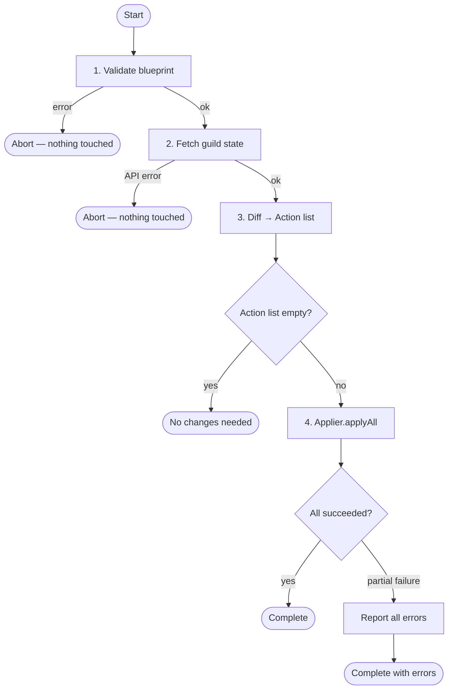
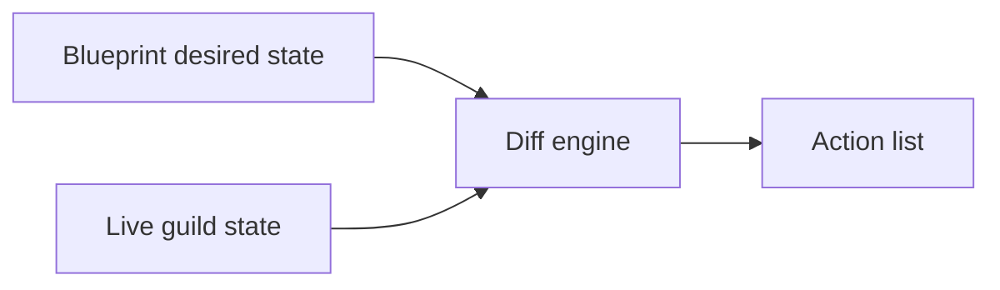
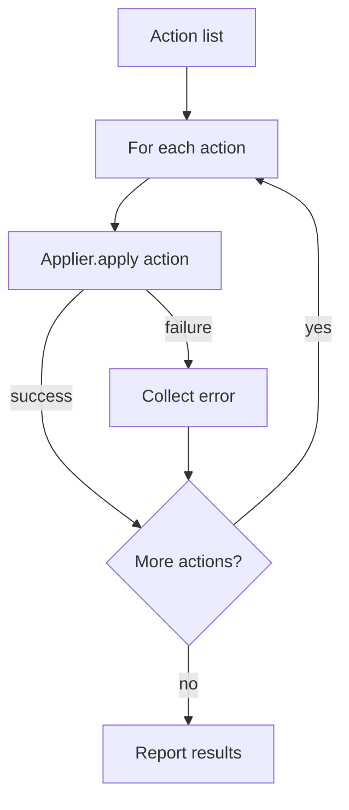

# The Reconciler

The reconciler is the engine that takes a `ServerBlueprint` and a live Discord guild and makes them match. It reads the current server state, computes the difference between what exists and what the blueprint declares, and produces a list of actions — which it can either print (dry run) or execute (apply).

---

## Mental model

Think of the blueprint as a migration file and the reconciler as the migration runner — except it is idempotent. Running it twice on an already-correct server does nothing. Running it after a change applies only what changed. There is no "already applied" state to track.

---

## Pipeline

The reconciler works in four sequential stages. The first three stages are read-only. The fourth stage is the only one that touches Discord.



---

## Stage 1 — Validate

Before touching the network, the reconciler checks that the blueprint itself is internally consistent. Validation happens at `Reconciler` construction time — an invalid blueprint throws immediately rather than failing later when reconciliation is triggered.

Checks performed:
- No duplicate channel names across the entire structure
- No duplicate category names
- No duplicate role names
- All channel names used in the structure are declared in the `ServerContext` type *(compile-time — cannot reach here if violated)*

**Error behaviour:** abort immediately. Nothing has been fetched or changed. The user fixes the blueprint and reruns.

---

## Stage 2 — Fetch

The reconciler reads the live guild state from the Discord API in a single pass:

- All roles (name, color, permissions, hoist, position, mentionable)
- All categories (name, position, permission overwrites)
- All channels (name, type, topic, position, parent category, permission overwrites, and all type-specific fields)

The result is a snapshot of the live server that the diff stage works against.

**Error behaviour:** abort immediately. A partial fetch could produce an incorrect diff.

---

## Stage 3 — Diff

The diff stage compares the blueprint's desired state against the fetched live state and produces an `Action[]`. No Discord API calls are made here.



For each declared resource, the diff checks:
- Does it exist on the live server? → `CREATE` action if not
- Does it match the blueprint exactly? → `UPDATE` action if not
- Are its permission overwrites exact? → `sync-permission-overwrite` actions for each discrepancy

For each live resource not in the blueprint:
- **Conservative mode (default):** emit a warning, no action added
- **Strict mode:** add a `DELETE` action

The action list is a typed discriminated union. Each action carries everything needed to describe itself in a dry run and execute itself in apply mode.

Actions use a generic three-variant union discriminated by both `type` and `resource`, rather than one variant per resource×operation:

```typescript
type ResourceType = "ROLE" | "CHANNEL" | "CATEGORY";

type ActionConfig = RoleDef | ChannelConfig | CategoryDef<ServerContext>;

type CreateAction = {
  type: "CREATE";
  resource: ResourceType;
  name: string;
  config: ActionConfig;
};

type UpdateAction = {
  type: "UPDATE";
  resource: ResourceType;
  name: string;
  referenceId: string; // Discord snowflake ID of the existing resource
  config: ActionConfig;
};

type DeleteAction = {
  type: "DELETE";
  resource: ResourceType;
  name: string;
  referenceId: string;
};

type Action = CreateAction | UpdateAction | DeleteAction;
```

Permission overwrite diffing extends this union with `sync-permission-overwrite` and `delete-permission-overwrite` variants:

```typescript
type Action =
  | CreateAction
  | UpdateAction
  | DeleteAction
  | { type: "sync-permission-overwrite";   targetId: string; targetName: string; overwrite: PermissionOverwrite<ServerContext> }
  | { type: "delete-permission-overwrite"; targetId: string; targetName: string; subject: string }
```

---

## Stage 4 — Apply

Apply behaviour is injectable via the `Applier` abstract class. `Reconciler` accepts an `Applier` at construction time and defaults to `LoggingApplier`, which logs each action without making any API calls — effectively a dry run. A real `GuildApplier` that calls the Discord API is passed in for live reconciliation.

```typescript
abstract class Applier {
  abstract apply(action: Action): Promise<void>;
  async applyAll(actions: Action[]): Promise<void> { ... }
}
```

### Logging (dry run)

When `LoggingApplier` is in use, actions are printed in a human-readable format. Nothing is sent to Discord.

```
  [reconciler] CREATE ROLE "moderator"
  [reconciler] UPDATE CHANNEL "general"
  [reconciler] DELETE ROLE "old-role"
```

### Live apply

Actions are executed against the Discord API **sequentially**, one at a time. Sequential execution is intentional:

- Predictable — each action completes before the next begins
- Safe — discord.js handles rate limiting automatically per route; sequential calls cooperate naturally with its internal queue
- Debuggable — failures are attributable to a specific action

**Error behaviour in apply:** errors are collected, not thrown. If an action fails, the reconciler logs the error and continues with the remaining actions. All failures are reported together at the end.

This is the correct behaviour because:
1. Most actions are independent — a failed role update does not affect channel creation
2. Applying as much as possible leaves the server closer to desired state
3. On the next reconcile run, the diff naturally includes whatever failed — no special retry logic is needed



---

## Progress events

Progress reporting is handled inside the `Applier` implementation. A `GuildApplier` can emit log lines, call callbacks, or write to a progress stream as part of its `apply` and `applyAll` implementations:

```typescript
class GuildApplier extends Applier {
  async apply(action: Action): Promise<void> {
    // ... call Discord API ...
    console.log(`  ✓ ${action.type} ${action.resource} "${action.name}"`);
  }

  async applyAll(actions: Action[]): Promise<void> {
    const errors: Array<{ action: Action; error: unknown }> = [];
    for (const action of actions) {
      try {
        await this.apply(action);
      } catch (err) {
        console.error(`  ✗ ${action.type} ${action.resource} "${action.name}"`);
        errors.push({ action, error: err });
      }
    }
    if (errors.length > 0) {
      throw new AggregateError(errors, `${errors.length} action(s) failed`);
    }
  }
}
```

---

## Unmanaged resources

Resources that exist on the live server but are not declared in the blueprint are called **unmanaged**. The reconciler's behaviour toward them depends on the mode:

| Mode | Behaviour |
|---|---|
| Conservative (default) | Warn in output, leave untouched |
| Strict (`--strict` or `strict: true`) | Add a `DELETE` action to the plan |

Declared resources are **always enforced exactly**, regardless of mode. If a channel exists in the blueprint but has drifted (wrong topic, wrong permissions), the reconciler corrects it. The conservative/strict distinction only applies to resources not mentioned in the blueprint at all.

See [ADR-0003](../adr/0003-unmanaged-resource-policy.md) for the full reasoning.

---

## Channel identity

In v1, the reconciler identifies channels by name. The blueprint channel name is the lookup key against the live server. This means:

- **Renaming a channel in the blueprint creates a new Discord channel.** The old channel becomes unmanaged.
- Message history is not preserved on rename.
- This is a known v1 limitation. A lock file system (`infracord.lock.json`) is planned for v2 to enable in-place renames by tracking Discord channel IDs.

See [ADR-0004](../adr/0004-channel-identity.md) for full details and the v2 path.

---

## Rate limiting

The reconciler does not implement any rate limit logic. discord.js maintains per-route rate limit buckets, reads `X-RateLimit-*` headers on every response, and queues requests automatically. Sequential action application cooperates naturally with this — there is nothing for infracord to add on top.

The highest-volume operation is permission overwrites: each overwrite on each channel is a separate API call. A large blueprint can produce many overwrite calls on a fresh apply. This is handled correctly by discord.js and is acceptable given reconciliation runs infrequently.

See [ADR-0005](../adr/0005-rate-limiting.md) for full details.
